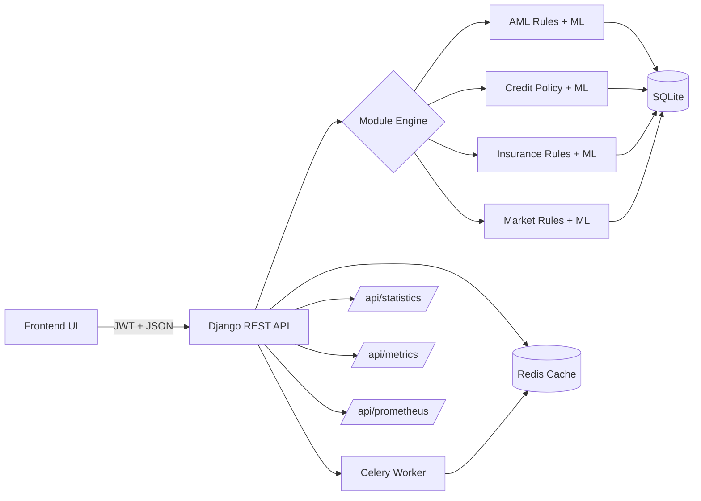

# 🧠 Backend - Django REST API

The backend powers fraud detection across AML, credit risk, insurance claims, and market manipulation. It is designed for local demos, fast iteration, and clean integration with the React + TypeScript frontend.

    

## 📋 Table of Contents

- [🌟 Overview](#-overview)
- [🛠 Tech Stack](#-tech-stack)
- [🚀 Getting Started](#-getting-started)
- [🔗 Key Endpoints](#-key-endpoints)
- [🔌 Frontend Integration](#-frontend-integration)
- [📊 Observability](#-observability)
- [🧭 End-to-End Flow](#-end-to-end-flow)
- [🔗 Frontend](#-frontend)
- [📄 License](#-license)
- [👤 Author](#-author)

## 🌟 Overview
This backend provides fraud detection APIs for AML, credit risk, insurance claims, and market manipulation. It runs on Django REST Framework and is optimized for quick local demos.

**Highlights:**
- ✅ **Redis state management** for recent activity cache
- ✅ **ML anomaly detection** using Isolation Forest rules
- ✅ **Celery async audits** for lightweight background tasks
- ✅ **Strategy pattern engines** for pluggable rule sets

The frontend is a React + TypeScript app (Vite) that calls this API at `http://localhost:8000/api`.

## 🛠 Tech Stack

### Core Framework
- **Django 4.2** - Web framework
- **Django REST Framework** - API layer

### ML & Detection
- **Scikit-Learn** - Isolation Forest anomaly detection
- **NumPy / Pandas** - Data processing helpers

### State & Async
- **Redis** - Cache and short-lived state
- **Celery** - Async task queue

### Observability
- **Prometheus Client** - Metrics exporter

## 🚀 Getting Started

### Prerequisites
- Docker Desktop
- Python 3.9+ (optional for local scripts)

### Local Run (Docker)
```bash
cd backend
docker compose up --build -d
docker compose logs -f celery_worker
```

### Environment Variables
- `DEBUG` (default: 1)
- `SECRET_KEY`
- `DJANGO_ALLOWED_HOSTS`
- `REDIS_HOST` (default: localhost)
- `REDIS_PORT` (default: 6379)
- `CELERY_BROKER_URL` (default: redis://localhost:6379/0)
- `CELERY_RESULT_BACKEND` (default: redis://localhost:6379/1)

## 🔗 Key Endpoints
- `GET /api/health/` - service health
- `GET /api/metrics/` - cache and async audit counts
- `GET /api/prometheus/` - Prometheus exporter
- `GET /api/statistics/` - dashboard statistics
- `POST /api/aml/detect/` - AML detection
- `POST /api/credit/assess/` - credit assessment
- `POST /api/insurance/detect/` - insurance claim detection
- `POST /api/market/detect/` - market manipulation detection

## 🔌 Frontend Integration
- **Frontend framework**: React 18 + TypeScript + Vite
- **Expected API base**: `http://localhost:8000/api`
- **Auth**: JWT via `/api/token/` and `/api/token/refresh/`
- **CORS**: enabled for local development
- **Dev servers**: backend on `:8000`, frontend on `:3000`

## 📊 Observability
- `GET /api/metrics/` returns JSON snapshots for UI.
- `GET /api/prometheus/` exposes counters and latency histograms for Prometheus.

## 🧭 End-to-End Flow


## 🔗 Frontend

- **Frontend**: [WorkOps Frontend](https://github.com/arunike/Fraud-Detection-Platform-Frontend)

## 📄 License

This project is licensed under the MIT License - see the [LICENSE](LICENSE.txt) file for details.

## 👤 Author

**Richie Zhou**

- GitHub: [@arunike](https://github.com/arunike)
