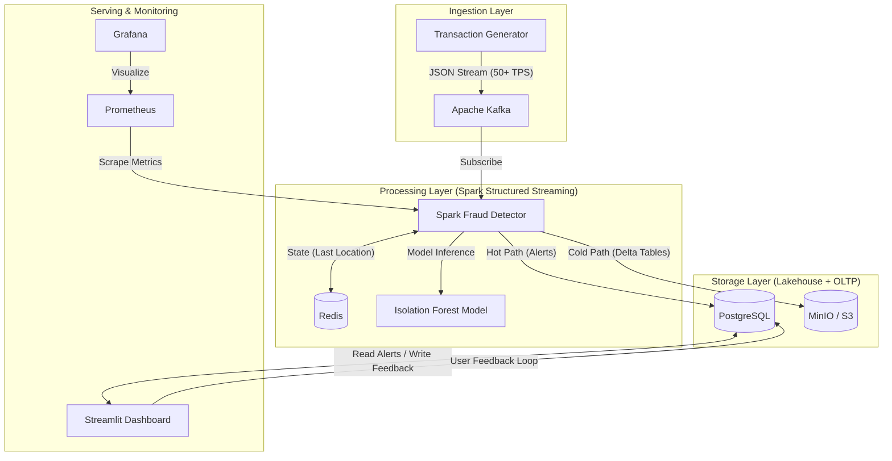

# Enterprise Real-Time Fraud Detection Platform

An enterprise-grade streaming analytics platform designed to detect payment fraud in real-time using **Machine Learning**, **Geo-Velocity Analysis**, and a **Data Lakehouse Architecture**.

## 🏗️ Architecture

This system uses a **Lambda Architecture** approach to handle both real-time alerts and long-term data archival.



## 🚀 Key Features

*   **Real-Time Anomaly Detection**:
    *   **ML-Based**: Uses `Isolation Forest` (trained on historical patterns) to flag statistical outliers in real-time.
    *   **Rule-Based**: instantly detects "Impossible Travel" (speed > 800km/h) and "High Value" transactions.
*   **Data Lakehouse Architecture**:
    *   Uses **MinIO** as an S3-compatible object store.
    *   Writes data in **Delta Lake** format (`delta-io`) for ACID transactions and time-travel capabilities on the data lake.
*   **Human-in-the-Loop Feedback**:
    *   Interactive Dashboard allows analysts to mark alerts as "True Fraud" or "False Positive".
    *   Feedback is persisted to PostgreSQL to retrain and improve the ML model in future cycles.
*   **Geospatial Visualization**:
    *   Live heatmap of global fraud attempts.
*   **Observability**:
    *   Integrated **Prometheus** and **Grafana** for monitoring system health and throughput.

## 🛠️ Tech Stack

*   **Streaming Engine**: Apache Spark 3.5 (Structured Streaming)
*   **Message Broker**: Apache Kafka
*   **Storage (Hot)**: PostgreSQL 15, Redis 7
*   **Storage (Cold/Lake)**: MinIO (S3), Delta Lake
*   **ML Framework**: Scikit-Learn (Isolation Forest)
*   **Visualization**: Streamlit, Plotly
*   **Monitoring**: Prometheus, Grafana
*   **Containerization**: Docker, Docker Compose

## ⚡ Quick Start

### Prerequisites
*   Docker Desktop (4GB+ RAM recommended)

### 1. Launch the Cluster
```bash
docker compose up --build -d
```
*Wait ~2-3 minutes for all services (Spark, Kafka, MinIO) to initialize.*

### 2. Access Interfaces

| Service | URL | Credentials | Description |
| :--- | :--- | :--- | :--- |
| **Fraud Dashboard** | [http://localhost:8501](http://localhost:8501) | *None* | Analyst UI for alerts & feedback |
| **Data Lake (MinIO)** | [http://localhost:9001](http://localhost:9001) | `minioadmin` / `minioadmin` | View raw Delta Lake tables |
| **Airflow (MLOps)** | [http://localhost:8081](http://localhost:8081) | `admin` / `admin` | Orchestrate model retraining |
| **Grafana** | [http://localhost:3000](http://localhost:3000) | `admin` / `admin` | System metrics & monitoring |

### 3. Verify the Pipeline
1.  **Dashboard**: You should see alerts appearing live.
2.  **Feedback**: Click "✅ True Fraud" on an alert.
3.  **Data Lake**: Log into MinIO, check `lake/transactions` bucket to see Parquet/Delta files.

### 4. Kubernetes Deployment (Production) ☸️
You can deploy the entire stack to a local Kubernetes cluster (like Docker Desktop or Minikube) using the included Helm Chart.

**Prerequisites**: `helm`, `kubectl`.

1.  **Deploy with Helm**:
    ```bash
    ./k8s/deploy.sh
    ```
2.  **Verify**:
    ```bash
    kubectl get pods
    kubectl port-forward svc/fraud-stack-dashboard 8501:8501
    ```
3.  **Stop & Cleanup**:
    ```bash
    helm uninstall fraud-stack
    ```
    *Note: To completely stop all K8s system pods (like `kube-apiserver`), go to Docker Desktop Settings -> Kubernetes -> Uncheck "Enable Kubernetes".*

## 📂 Project Structure

```
├── docker-compose.yml       # Dev Environment (10+ microservices)
├── src/
│   ├── generator/           # High-throughput transaction simulator
│   ├── detector/            # Spark Streaming job (Delta + ML + Kafka)
│   ├── dashboard/           # Streamlit UI with SQL integration
│   └── model/               # Airflow Retraining Scripts
├── dags/                    # Airflow DAGs
├── k8s/                     # Helm Charts & Kubernetes Manifests
└── Dockerfile.spark         # Custom Spark image with Delta/AWS libs
```
