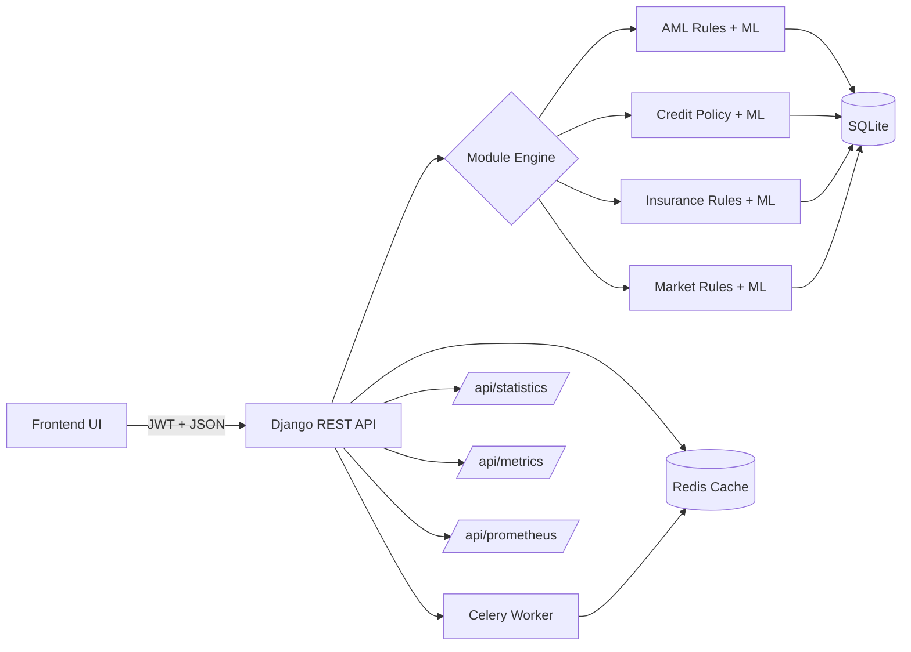

# 🧠 Backend - Django REST API

The backend powers fraud detection across AML, credit risk, insurance claims, and market manipulation. It is designed for local demos, fast iteration, and clean integration with the React + TypeScript frontend.

    

## 📋 Table of Contents
- [🧠 Backend - Django REST API](#-backend---django-rest-api)
  - [📋 Table of Contents](#-table-of-contents)
  - [🌟 Overview](#-overview)
  - [🛠 Tech Stack](#-tech-stack)
    - [Core Framework](#core-framework)
    - [ML \& Detection](#ml--detection)
    - [State \& Async](#state--async)
    - [Observability](#observability)
  - [🚀 Getting Started](#-getting-started)
    - [Prerequisites](#prerequisites)
    - [Local Run (Docker)](#local-run-docker)
    - [Environment Variables](#environment-variables)
  - [🔗 Key Endpoints](#-key-endpoints)
  - [🔌 Frontend Integration](#-frontend-integration)
  - [📊 Observability](#-observability)
  - [🧪 Example Requests](#-example-requests)
    - [AML Detection](#aml-detection)
    - [Credit Assessment](#credit-assessment)
    - [Insurance Claim](#insurance-claim)
    - [Market Manipulation](#market-manipulation)
  - [✅ Example Responses](#-example-responses)
    - [AML Detection (Response)](#aml-detection-response)
    - [Credit Assessment (Response)](#credit-assessment-response)
    - [Insurance Claim (Response)](#insurance-claim-response)
    - [Market Manipulation (Response)](#market-manipulation-response)
  - [🧭 End-to-End Flow](#-end-to-end-flow)
  - [⚠️ Notes](#️-notes)
  - [🧩 Troubleshooting](#-troubleshooting)

## 🌟 Overview
This backend provides fraud detection APIs for AML, credit risk, insurance claims, and market manipulation. It runs on Django REST Framework and is optimized for quick local demos.

**Highlights:**
- ✅ **Redis state management** for recent activity cache
- ✅ **ML anomaly detection** using Isolation Forest rules
- ✅ **Celery async audits** for lightweight background tasks
- ✅ **Strategy pattern engines** for pluggable rule sets

The frontend is a React + TypeScript app (Vite) that calls this API at `http://localhost:8000/api`.

## 🛠 Tech Stack

### Core Framework
- **Django 4.2** - Web framework
- **Django REST Framework** - API layer

### ML & Detection
- **Scikit-Learn** - Isolation Forest anomaly detection
- **NumPy / Pandas** - Data processing helpers

### State & Async
- **Redis** - Cache and short-lived state
- **Celery** - Async task queue

### Observability
- **Prometheus Client** - Metrics exporter

## 🚀 Getting Started

### Prerequisites
- Docker Desktop
- Python 3.9+ (optional for local scripts)

### Local Run (Docker)
```bash
cd backend
docker compose up --build -d
docker compose logs -f celery_worker
```

### Environment Variables
- `DEBUG` (default: 1)
- `SECRET_KEY`
- `DJANGO_ALLOWED_HOSTS`
- `REDIS_HOST` (default: localhost)
- `REDIS_PORT` (default: 6379)
- `CELERY_BROKER_URL` (default: redis://localhost:6379/0)
- `CELERY_RESULT_BACKEND` (default: redis://localhost:6379/1)

## 🔗 Key Endpoints
- `GET /api/health/` - service health
- `GET /api/metrics/` - cache and async audit counts
- `GET /api/prometheus/` - Prometheus exporter
- `GET /api/statistics/` - dashboard statistics
- `POST /api/aml/detect/` - AML detection
- `POST /api/credit/assess/` - credit assessment
- `POST /api/insurance/detect/` - insurance claim detection
- `POST /api/market/detect/` - market manipulation detection

## 🔌 Frontend Integration
- **Frontend framework**: React 18 + TypeScript + Vite
- **Expected API base**: `http://localhost:8000/api`
- **Auth**: JWT via `/api/token/` and `/api/token/refresh/`
- **CORS**: enabled for local development
- **Dev servers**: backend on `:8000`, frontend on `:3000`

## 📊 Observability
- `GET /api/metrics/` returns JSON snapshots for UI.
- `GET /api/prometheus/` exposes counters and latency histograms for Prometheus.

## 🧪 Example Requests

### AML Detection
```bash
curl -X POST http://localhost:8000/api/aml/detect/ \
	-H "Content-Type: application/json" \
	-d '{"transaction_id":"TXN-1001","user_id":"U-1","amount":9800,"sender_id":"S-1","receiver_id":"R-1"}'
```

### Credit Assessment
```bash
curl -X POST http://localhost:8000/api/credit/assess/ \
	-H "Content-Type: application/json" \
	-d '{"applicant_id":"USER-101","monthly_income":4200,"employment_length":24}'
```

### Insurance Claim
```bash
curl -X POST http://localhost:8000/api/insurance/detect/ \
	-H "Content-Type: application/json" \
	-d '{"claim_id":"CLM-001","policy_id":"POL-9","claim_amount":45000,"estimated_value":52000}'
```

### Market Manipulation
```bash
curl -X POST http://localhost:8000/api/market/detect/ \
	-H "Content-Type: application/json" \
	-d '{"symbol":"MSFT","price":425.5,"volume":12000,"trader_id":"TR-99"}'
```

## ✅ Example Responses

### AML Detection (Response)
```json
{
  "id": 1,
  "transaction_id": "TXN-1001",
  "amount": 9800.0,
  "sender_id": "S-1",
  "receiver_id": "R-1",
  "risk_score": 78.5,
  "timestamp": "2026-02-09T09:12:33.221Z",
  "alerts": [
    {
      "rule": "StructuringRule",
      "severity": "high",
      "confidence": 0.78,
      "reason": "Structuring detected: 3 transactions totaling $29500.00 in 24h, all below $10000.0 threshold",
      "metadata": {
        "num_transactions": 3,
        "total_amount": 29500.0
      }
    }
  ]
}
```

### Credit Assessment (Response)
```json
{
  "id": 5,
  "applicant_id": "USER-101",
  "risk_score": 712,
  "decision": "APPROVED",
  "timestamp": "2026-02-09T09:14:11.004Z",
  "alerts": [
    {
      "type": "reason_code",
      "message": "APPROVED",
      "severity": "medium"
    }
  ],
  "credit_score": 712,
  "risk_tier": "MEDIUM",
  "factors": {
    "payment_history": 0.92,
    "amounts_owed": 0.74,
    "length_of_credit": 0.61,
    "new_credit": 0.9,
    "credit_mix": 0.8
  }
}
```

### Insurance Claim (Response)
```json
{
  "id": 3,
  "claim_id": "CLM-001",
  "policy_id": "POL-9",
  "claim_amount": 45000.0,
  "fraud_risk": 62.0,
  "timestamp": "2026-02-09T09:16:45.876Z",
  "alerts": [
    {
      "rule": "PropertyInflationRule",
      "severity": "medium",
      "confidence": 0.62,
      "reason": "Property claim inflation suspected (score: 0.62)",
      "evidence": [
        "Estimated value $52000.00 is 1.6x higher than market value $32000.00"
      ]
    }
  ],
  "fraud_probability": 0.62,
  "flagged": true
}
```

### Market Manipulation (Response)
```json
{
  "id": 7,
  "symbol": "MSFT",
  "price": 425.5,
  "volume": 12000.0,
  "manipulation_risk": 71.0,
  "timestamp": "2026-02-09T09:18:20.112Z",
  "alerts": [
    {
      "rule": "Pump And Dump",
      "alert_type": "pump_and_dump",
      "severity": "HIGH",
      "confidence": 0.71,
      "reason": "Pump and dump pattern detected (score: 0.71)",
      "evidence": [
        "Trading volume 5.2x higher than 30-day average",
        "Price surged 25.0% in 24 hours"
      ]
    }
  ]
}
```

## 🧭 End-to-End Flow


## ⚠️ Notes
- Redis is used for short-lived state and demo metrics only.
- ML model is trained on synthetic defaults and can be replaced with real data.
- ML model artifacts are written to `backend/ml_models`.

## 🧩 Troubleshooting
- **401 errors**: make sure the frontend has a valid JWT in localStorage.
- **No metrics**: trigger a detection call to generate events.
- **Empty charts**: confirm `/api/statistics/` returns data.
