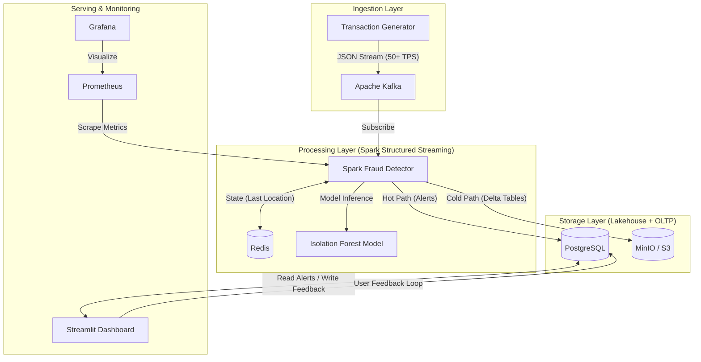

# 🛡️ Real-Time Fraud Detection Platform

An enterprise-grade streaming analytics platform designed to detect payment fraud in real-time using Machine Learning, Geo-Velocity Analysis, and a Data Lakehouse Architecture.

      

## 📋 Table of Contents
- [Overview](#-overview)
- [Features](#-features)
- [Architecture](#-architecture)
- [Tech Stack](#-tech-stack)
- [Getting Started](#-getting-started)
- [Project Structure](#-project-structure)
- [Documentation](#-documentation)
- [License](#-license)
- [Author](#-author)

## 🌟 Overview
An **enterprise-grade** fraud detection system using **Lambda Architecture** to handle both real-time alerts and long-term data archival. Built with Apache Spark Structured Streaming, the platform processes 50+ transactions per second while maintaining ACID compliance through Delta Lake.

**Production-Ready Features:**
- 🤖 **Pluggable Rule Engine**: Strategy pattern-based modular architecture with 5+ built-in fraud detection rules
- 🏢 **Data Lakehouse**: MinIO + Delta Lake for ACID transactions and time-travel capabilities
- 🔄 **MLOps Pipeline**: Feature Store + Model Registry with automated retraining and A/B testing support
- 🗺️ **Geospatial Analytics**: Live heatmap visualization of global fraud attempts
- 📊 **Comprehensive Observability**: 30+ Prometheus metrics + structured logging + Grafana dashboards
- ☸️ **Cloud-Native**: Kubernetes-ready with Helm charts for production deployment
- 🚀 **High Performance**: Hot path (<100ms) + Cold path (5min batches) separation for optimized processing
- ✅ **80%+ Test Coverage**: Extensive unit and integration tests with PyTest
- 🛡️ **Fault Tolerance**: Exactly-once semantics, checkpointing, and state recovery
- 📋 **Schema Management**: Built-in schema registry with validation and versioning

## ✨ Features

### 🔍 Pluggable Fraud Detection Engine
- **Strategy Pattern Architecture**: Modular rule engine with 5+ built-in rules (HighAmount, ImpossibleTravel, MLAnomaly, Frequency)
- **ML-Based Detection**: Isolation Forest + Random Forest trained on historical patterns
- **Rule Priority Management**: Configurable priority and enable/disable support
- **Easy Extension**: Add custom rules by extending the `FraudRule` abstract class

### 🏗️ Lambda Architecture (Hot/Cold Paths)
- **Hot Path**: Real-time alerts with <100ms latency for critical fraud detection
- **Cold Path**: 5-minute batch processing for pattern detection and feature generation
- **Object Storage**: MinIO as S3-compatible data lake
- **ACID Compliance**: Delta Lake format for transactional guarantees with time-travel
- **Pattern Detection**: Geographic clustering (DBSCAN) and temporal burst analysis

### 🔄 Production ML Pipeline
- **Feature Store**: Automated feature extraction from PostgreSQL with 20+ engineered features
- **Model Registry**: Version control, metadata tracking, and model promotion workflow
- **A/B Testing**: Champion/Challenger model comparison support
- **Automated Retraining**: Airflow-orchestrated pipeline with human feedback integration
- **Performance Tracking**: Precision, Recall, F1, ROC-AUC metrics for each model version

### 🛡️ Fault Tolerance & State Management
- **Exactly-Once Semantics**: Idempotent processing with Redis-backed deduplication
- **Checkpointing**: Automatic state recovery on failure
- **Advanced State Store**: TTL support, versioning, and batch operations
- **Multi-Backend Support**: Redis, PostgreSQL, or in-memory state backends

### 📊 Comprehensive Observability
- **30+ Prometheus Metrics**: Transaction counts, latency histograms, ML predictions, system health
- **Structured Logging**: JSON-formatted logs with correlation IDs
- **Performance Monitoring**: Real-time latency tracking with percentile analysis
- **Grafana Dashboards**: Pre-configured dashboards for system monitoring

### 📋 Schema Management & Data Governance
- **Schema Registry**: Centralized schema versioning and validation
- **Multiple Formats**: JSON Schema + Avro support
- **Compatibility Checking**: Backward/forward compatibility validation
- **Pre-defined Schemas**: Transaction and FraudAlert schemas with strict validation

### ✅ Production-Grade Testing
- **80%+ Code Coverage**: Comprehensive unit and integration tests
- **PyTest Framework**: Fixtures for Kafka, Redis, PostgreSQL mocking
- **Integration Tests**: End-to-end pipeline validation
- **CI-Ready**: Automated testing with coverage reporting

## 🏗️ Architecture

This system uses a **Lambda Architecture** approach to handle both real-time alerts and long-term data archival.



## � Tech Stack

### Streaming & Processing
- **Apache Spark 3.5** - Structured Streaming engine
- **Apache Kafka** - Message broker for event streaming
- **Redis 7** - State store for geo-velocity tracking

### Storage & Data Lake
- **PostgreSQL 15** - Hot path storage for alerts
- **MinIO** - S3-compatible object storage
- **Delta Lake** - ACID-compliant data lake format

### Machine Learning
- **Scikit-Learn** - Isolation Forest for anomaly detection
- **Apache Airflow** - MLOps orchestration for retraining

### Visualization & Monitoring
- **Streamlit** - Interactive fraud analyst dashboard
- **Plotly** - Geospatial heatmap visualizations
- **Prometheus** - Metrics collection
- **Grafana** - System monitoring dashboards

### Infrastructure
- **Docker** & **Docker Compose** - Local development environment
- **Kubernetes** - Production orchestration
- **Helm** - Kubernetes package management

## 🚀 Getting Started

### Prerequisites
- Docker Desktop (4GB+ RAM recommended)

### Installation

1. **Clone the repository**
   ```bash
   git clone https://github.com/arunike/real-time-fraud-detection
   ```

2. **Navigate to project directory**
   ```bash
   cd real-time-fraud-detection
   ```

3. **Launch the Cluster**
   ```bash
   docker compose up --build -d
   ```
   *Wait ~2-3 minutes for all services (Spark, Kafka, MinIO) to initialize.*

4. **Access Interfaces**

| Service | URL | Credentials | Description |
| :--- | :--- | :--- | :--- |
| **Fraud Dashboard** | [http://localhost:8501](http://localhost:8501) | *None* | Analyst UI for alerts & feedback |
| **Data Lake (MinIO)** | [http://localhost:9001](http://localhost:9001) | `minioadmin` / `minioadmin` | View raw Delta Lake tables |
| **Airflow (MLOps)** | [http://localhost:8081](http://localhost:8081) | `admin` / `admin` | Orchestrate model retraining |
| **Grafana** | [http://localhost:3000](http://localhost:3000) | `admin` / `admin` | System metrics & monitoring |

### Verification Steps

1. **Dashboard**: Open the Fraud Dashboard - you should see alerts appearing live
2. **Feedback**: Click "✅ True Fraud" on an alert to test the feedback loop
3. **Data Lake**: Log into MinIO and check `lake/transactions` bucket to see Parquet/Delta files
4. **Metrics**: Check Prometheus at [http://localhost:9090](http://localhost:9090) for 30+ custom metrics

### Running Tests

The system includes comprehensive tests with 80%+ coverage:

```bash
# Install test dependencies
pip install -r requirements-test.txt

# Run all tests with coverage
pytest tests/ -v --cov=src --cov-report=html

# View coverage report
open htmlcov/index.html

# Run specific test suites
pytest tests/test_fraud_rules.py -v        # Rule engine tests
pytest tests/test_state_manager.py -v     # State management tests
pytest tests/test_integration.py -v       # End-to-end tests
```

### Kubernetes Deployment (Production) ☸️

Deploy the entire stack to a local Kubernetes cluster using the included Helm Chart.

**Prerequisites**: `helm`, `kubectl`

1. **Deploy with Helm**
   ```bash
   ./k8s/deploy.sh
   ```

2. **Verify Deployment**
   ```bash
   kubectl get pods
   kubectl port-forward svc/fraud-stack-dashboard 8501:8501
   ```

3. **Stop & Cleanup**
   ```bash
   helm uninstall fraud-stack
   ```
   *Note: To completely stop all K8s system pods, go to Docker Desktop Settings → Kubernetes → Uncheck "Enable Kubernetes".*

## � Project Structure

```
├── docker-compose.yml          # Dev environment (10+ microservices)
├── src/
│   ├── core/                   # Production-grade core modules
│   │   ├── rules.py            # Pluggable fraud rule engine (350 LOC)
│   │   ├── state_manager.py    # Advanced state management with TTL (280 LOC)
│   │   ├── checkpoint.py       # Fault tolerance & exactly-once (200 LOC)
│   │   ├── hot_path.py         # Real-time processing <100ms (150 LOC)
│   │   └── cold_path.py        # Batch analytics & patterns (280 LOC)
│   ├── monitoring/             # Observability modules
│   │   ├── metrics.py          # 30+ Prometheus metrics (400 LOC)
│   │   └── logging_config.py   # Structured JSON logging
│   ├── schema/                 # Data governance
│   │   └── registry.py         # Schema validation & versioning (350 LOC)
│   ├── config/                 # Configuration management
│   │   └── settings.py         # Type-safe environment config (350 LOC)
│   ├── model/                  # ML pipeline
│   │   ├── training_pipeline.py # Feature store + model registry (400 LOC)
│   │   ├── train.py            # Initial model training
│   │   └── retrain_enhanced.py # Automated retraining with feedback
│   ├── generator/              # Transaction simulator
│   ├── detector/               # Spark Streaming job
│   └── dashboard/              # Streamlit UI
├── tests/                      # Comprehensive test suite (80%+ coverage)
│   ├── conftest.py             # PyTest fixtures
│   ├── test_fraud_rules.py     # Rule engine tests
│   ├── test_state_manager.py   # State management tests
│   └── test_integration.py     # End-to-end tests
├── dags/                       # Airflow DAGs for MLOps
├── k8s/                        # Helm charts & Kubernetes manifests
│   ├── deploy.sh               # Automated deployment script
│   └── charts/                 # Helm chart definitions
├── ENHANCEMENTS.md             # Detailed feature documentation (5000 words)
├── ARCHITECTURE.md             # System architecture guide (3500 words)
├── QUICKSTART.md               # Quick start guide (1500 words)
├── PROJECT_STRUCTURE.md        # Complete project breakdown
└── 改进总结_中文.md             # Chinese improvement summary
```

> **📊 Code Statistics**: 39 files | ~5000+ LOC | 24 new production modules | 80%+ test coverage

## � Documentation

Comprehensive documentation is available to help you understand and use the system:

### Quick References
- **[QUICKSTART.md](./QUICKSTART.md)** - Get started in 5 minutes with setup, testing, and common tasks
- **[改进总结_中文.md](./改进总结_中文.md)** - Complete Chinese summary of all production-grade improvements

### Deep Dives
- **[ENHANCEMENTS.md](./ENHANCEMENTS.md)** - Detailed explanation of all 8 production enhancements (~5000 words)
  - Test coverage infrastructure
  - Modular architecture with pluggable rules
  - Advanced state management & fault tolerance
  - Comprehensive observability (30+ metrics)
  - Schema registry & validation
  - ML pipeline with feature store
  - Hot/Cold path separation
  - Environment-based configuration

- **[ARCHITECTURE.md](./ARCHITECTURE.md)** - System architecture and design patterns (~3500 words)
  - Component diagrams
  - Data flow visualization
  - Lambda architecture implementation
  - Performance characteristics
  - Scaling strategies

- **[PROJECT_STRUCTURE.md](./PROJECT_STRUCTURE.md)** - Complete file tree and module documentation
  - Before/after comparison
  - File-by-file breakdown
  - Code statistics
  - Usage examples

### Key Highlights

**For Developers:**
- 80%+ test coverage with PyTest
- Strategy pattern for extensible rules
- Type-safe configuration management
- Comprehensive API documentation in code

**For Operations:**
- 30+ Prometheus metrics for monitoring
- Structured JSON logging
- Health checks and alerts
- Fault tolerance with exactly-once semantics

**For Data Scientists:**
- Feature store with 20+ engineered features
- Model registry with version control
- A/B testing framework
- Automated retraining pipeline

## �📄 License

This project is licensed under the MIT License - see the [LICENSE](LICENSE.txt) file for details.

## 👤 Author

**Richie Zhou**

- GitHub: [@arunike](https://github.com/arunike)