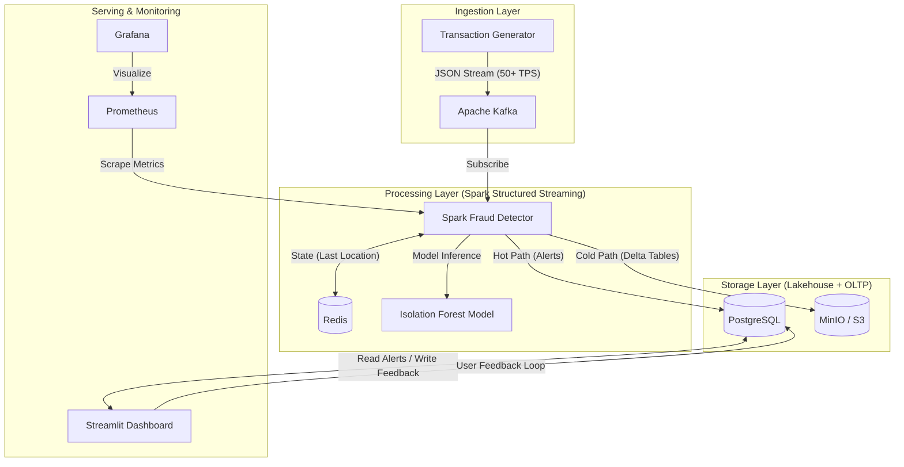

# 🛡️ Real-Time Fraud Detection Platform

An enterprise-grade streaming analytics platform designed to detect payment fraud in real-time using Machine Learning, Geo-Velocity Analysis, and a Data Lakehouse Architecture.

    

## 📋 Table of Contents
- [Overview](#-overview)
- [Features](#-features)
- [Architecture](#-architecture)
- [Tech Stack](#-tech-stack)
- [Getting Started](#-getting-started)
- [Project Structure](#-project-structure)
- [License](#-license)
- [Author](#-author)

## 🌟 Overview
A production-ready fraud detection system using **Lambda Architecture** to handle both real-time alerts and long-term data archival. Built with Apache Spark Structured Streaming, the platform processes 50+ transactions per second while maintaining ACID compliance through Delta Lake.

**Key Capabilities:**
- 🤖 **Dual Detection Strategy**: ML-based anomaly detection with Isolation Forest + rule-based geo-velocity checks
- 🏢 **Data Lakehouse**: MinIO + Delta Lake for ACID transactions and time-travel capabilities
- 🔄 **Human-in-the-Loop**: Interactive feedback system for continuous model improvement
- 🗺️ **Geospatial Analytics**: Live heatmap visualization of global fraud attempts
- 📊 **Production Monitoring**: Integrated Prometheus and Grafana for observability
- ☸️ **Cloud-Native**: Kubernetes-ready with Helm charts for production deployment
- 🚀 **High Throughput**: Processes 50+ TPS with sub-second latency

## ✨ Features

### 🔍 Real-Time Anomaly Detection
- **ML-Based Detection**: Isolation Forest trained on historical patterns to flag statistical outliers
- **Rule-Based Detection**: Instant "Impossible Travel" detection (speed > 800km/h) and high-value transaction alerts
- **Streaming Inference**: Real-time scoring using Apache Spark Structured Streaming

### 🏗️ Data Lakehouse Architecture
- **Object Storage**: MinIO as S3-compatible data lake
- **ACID Compliance**: Delta Lake format (`delta-io`) for transactional guarantees
- **Time Travel**: Query historical data states for auditing and analysis
- **Hot/Cold Paths**: Fast alerts to PostgreSQL, archival to Delta tables

### 🔄 Human-in-the-Loop Feedback
- **Interactive Dashboard**: Analyst UI for alert review and classification
- **Feedback Persistence**: True Fraud / False Positive labeling stored in PostgreSQL
- **Model Retraining**: Airflow-orchestrated retraining pipeline using feedback data

### 📊 Visualization & Monitoring
- **Geospatial Heatmap**: Live visualization of fraud attempts across the globe
- **System Metrics**: Prometheus metrics with Grafana dashboards
- **Alert Analytics**: Real-time statistics on detection rates and patterns

## 🏗️ Architecture

This system uses a **Lambda Architecture** approach to handle both real-time alerts and long-term data archival.



## � Tech Stack

### Streaming & Processing
- **Apache Spark 3.5** - Structured Streaming engine
- **Apache Kafka** - Message broker for event streaming
- **Redis 7** - State store for geo-velocity tracking

### Storage & Data Lake
- **PostgreSQL 15** - Hot path storage for alerts
- **MinIO** - S3-compatible object storage
- **Delta Lake** - ACID-compliant data lake format

### Machine Learning
- **Scikit-Learn** - Isolation Forest for anomaly detection
- **Apache Airflow** - MLOps orchestration for retraining

### Visualization & Monitoring
- **Streamlit** - Interactive fraud analyst dashboard
- **Plotly** - Geospatial heatmap visualizations
- **Prometheus** - Metrics collection
- **Grafana** - System monitoring dashboards

### Infrastructure
- **Docker** & **Docker Compose** - Local development environment
- **Kubernetes** - Production orchestration
- **Helm** - Kubernetes package management

## 🚀 Getting Started

### Prerequisites
- Docker Desktop (4GB+ RAM recommended)

### Installation

1. **Clone the repository**
   ```bash
   git clone https://github.com/arunike/real-time-fraud-detection
   ```

2. **Navigate to project directory**
   ```bash
   cd real-time-fraud-detection
   ```

3. **Launch the Cluster**
   ```bash
   docker compose up --build -d
   ```
   *Wait ~2-3 minutes for all services (Spark, Kafka, MinIO) to initialize.*

4. **Access Interfaces**

| Service | URL | Credentials | Description |
| :--- | :--- | :--- | :--- |
| **Fraud Dashboard** | [http://localhost:8501](http://localhost:8501) | *None* | Analyst UI for alerts & feedback |
| **Data Lake (MinIO)** | [http://localhost:9001](http://localhost:9001) | `minioadmin` / `minioadmin` | View raw Delta Lake tables |
| **Airflow (MLOps)** | [http://localhost:8081](http://localhost:8081) | `admin` / `admin` | Orchestrate model retraining |
| **Grafana** | [http://localhost:3000](http://localhost:3000) | `admin` / `admin` | System metrics & monitoring |

### Verification Steps

1. **Dashboard**: Open the Fraud Dashboard - you should see alerts appearing live
2. **Feedback**: Click "✅ True Fraud" on an alert to test the feedback loop
3. **Data Lake**: Log into MinIO and check `lake/transactions` bucket to see Parquet/Delta files

### Kubernetes Deployment (Production) ☸️

Deploy the entire stack to a local Kubernetes cluster using the included Helm Chart.

**Prerequisites**: `helm`, `kubectl`

1. **Deploy with Helm**
   ```bash
   ./k8s/deploy.sh
   ```

2. **Verify Deployment**
   ```bash
   kubectl get pods
   kubectl port-forward svc/fraud-stack-dashboard 8501:8501
   ```

3. **Stop & Cleanup**
   ```bash
   helm uninstall fraud-stack
   ```
   *Note: To completely stop all K8s system pods, go to Docker Desktop Settings → Kubernetes → Uncheck "Enable Kubernetes".*

## � Project Structure

```
├── docker-compose.yml       # Dev environment (10+ microservices)
├── src/
│   ├── generator/           # High-throughput transaction simulator
│   ├── detector/            # Spark Streaming job (Delta + ML + Kafka)
│   ├── dashboard/           # Streamlit UI with SQL integration
│   └── model/               # Airflow retraining scripts
├── dags/                    # Airflow DAGs for MLOps
├── k8s/                     # Helm charts & Kubernetes manifests
│   ├── deploy.sh            # Automated deployment script
│   └── charts/              # Helm chart definitions
└── Dockerfile.spark         # Custom Spark image with Delta/AWS libraries
```

## 📄 License

This project is licensed under the MIT License - see the [LICENSE](LICENSE.txt) file for details.

## 👤 Author

**Richie Zhou**

- GitHub: [@arunike](https://github.com/arunike)